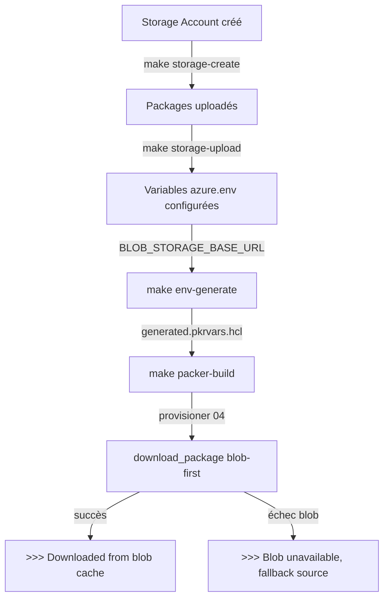

---
# 🤖 Machine-Readable Metadata (Frontmatter YAML)
adr: 616
title: "Blob Storage Azure comme Cache de Packages pour les Builds Packer"
status: "accepted"
date: 2026-05-08
superseded_by: null
replaces: null
related_adrs: [600, 614]
related_issues: []

# 🗂️ Taxonomie ADR
classification:
  lifecycle: "accepted"
  domain: "devops"
  impact: "high"
  quality:
    - "reliability"
    - "performance"
    - "maintainability"
  reversibility: "moderate"
  scope: "tactical"
  tech_areas:
    - "azure"
    - "packer"
    - "bash"

tags: ["packer", "azure-blob-storage", "cache", "packages", "provisioning", "build-time"]
stakeholders: ["@devops-team", "@dev-team"]
effort: "medium"
---

# ADR 616: Blob Storage Azure comme Cache de Packages pour les Builds Packer

## 📊 Vue d'Ensemble

| Attribut | Valeur |
|----------|--------|
| **Statut** | ✅ Accepté |
| **Date Décision** | 2026-05-08 |
| **Stakeholders** | @devops-team, @dev-team |
| **Impact** | 🟡 Moyen |
| **Effort Implémentation** | 🟡 Moyen |
| **Risque Technique** | 🟢 Faible |

---

## 🎯 Contexte & Problème

### Questions Guidées

**1. Quel problème essayons-nous de résoudre?**

Le build Packer de l'image VM SMW nécessite le téléchargement de **6 archives volumineuses** depuis des miroirs publics externes (GitHub Releases, Apache Archives) à chaque exécution :

| Package | Taille approximative | Source originale |
|---------|---------------------|------------------|
| `mediawiki-1.43.0.tar.gz`   | ~45 MB  | releases.wikimedia.org |
| `smw-6.0.1.tar.gz`           | ~5 MB   | github.com/SemanticMediaWiki |
| `php8.2-extensions.tar.gz`  | ~25 MB  | ppa.launchpad.net |
| `apache-composer-3.9.9-bin.tar.gz` | ~10 MB | archive.apache.org |
| `apache-ant-1.10.15-bin.tar.gz` | ~4 MB | archive.apache.org |
| `mysql-server-8.0.tar.gz`    | ~10 MB  | downloads.mysql.com |

Ces téléchargements depuis des miroirs publics présentent plusieurs problèmes constatés :
- **Timeouts fréquents** : `apt install php8.2` via les miroirs Ubuntu échoue régulièrement après 8 minutes de hang
- **Latence variable** : Les miroirs Apache/GitHub ont des performances inconsistantes selon l'heure et la région
- **Dépendance réseau externe** : Toute indisponibilité d'un miroir interrompt un build de ~45 minutes sans retour possible
- **Reproductibilité compromise** : Différentes versions peuvent être retournées si la version exacte n'est plus disponible sur le miroir courant

**2. Quelles sont les contraintes et exigences?**

- **Techniques** : Les provisioners Packer s'exécutent dans un contexte sans état sur une VM temporaire Azure ARM ; les variables d'environnement sont le seul mécanisme de paramétrage entre le host Packer et les scripts shell
- **Azure** : Le Storage Account doit être dans la même région (`canadacentral`) que les builds Packer pour maximiser la vitesse de téléchargement et éviter les coûts d'egress inter-régions
- **Sécurité** : Le blob container est en accès public lecture uniquement (`--public-access blob`) — pas d'authentification dans les provisioners, ce qui est acceptable pour des binaires publics mis en cache
- **Versioning** : Les noms de fichiers blob incluent le numéro de version (`apache-ant-1.10.15-bin.tar.gz`) pour permettre plusieurs versions coexistantes

**3. Quel est l'impact si nous ne prenons pas de décision?**

- **Court terme** : Builds Packer qui échouent de façon non-déterministe (timeout `apt install php8.2` constaté le 2026-05-07)
- **Moyen terme** : Impossibilité d'automatiser le pipeline CI/CD de build image sans garantie de succès
- **Long terme** : Chaque mise à jour de version de MediaWiki/Apache/MySQL expose à de nouvelles instabilités réseau

**4. Quels facteurs influencent cette décision?**

- Le projet dispose déjà d'un Storage Account Azure (`stsmwmarketplace`) pour les assets DevOps (ADR-600)
- Packer supporte nativement l'injection de variables d'environnement via `environment_vars` dans les builders `azure-arm`
- Les packages ciblés sont des binaires publics redistribuables librement (Apache License 2.0, MIT)
- ADR-608 (non-duplication fonctionnelle) requiert que le mécanisme soit centralisé et réutilisable

---

## ✅ Décision

Nous adoptons **Azure Blob Storage (`stsmwmarketplace.blob.core.windows.net/devops`) comme cache primaire de packages** pour les builds Packer, avec fallback automatique vers les sources originales.

### Approche Choisie

#### Architecture : Pattern blob-first avec fallback

Chaque provisioner qui télécharge un package volumieux intègre une fonction `download_package()` implémentant un pattern `blob-first → fallback source` :

```bash
download_package() {
    local blob_filename="$1"   # Ex: apache-ant-1.10.15-bin.tar.gz
    local source_url="$2"      # URL source officielle (fallback)
    local output_file="$3"     # Chemin de destination

    if [[ -n "${BLOB_STORAGE_BASE_URL}" ]]; then
        local blob_url="${BLOB_STORAGE_BASE_URL}/${blob_filename}"
        echo ">>> Trying blob cache: ${blob_url}"
        if wget -q --spider "${blob_url}" 2>/dev/null && wget -q "${blob_url}" -O "${output_file}"; then
            echo ">>> Downloaded from blob cache"
            return 0
        else
            echo ">>> Blob unavailable, falling back to source..."
        fi
    fi

    echo ">>> Downloading from source: ${source_url}"
    wget -q "${source_url}" -O "${output_file}"
}
```

La vérification en deux temps (`--spider` puis download) permet de distinguer un blob absent d'un échec de téléchargement, et de tomber proprement en fallback dans les deux cas.

#### Chaîne de paramétrage Packer

La variable `BLOB_STORAGE_BASE_URL` transite par la chaîne suivante sans duplication :

```
packer/env/azure.env
  └── BLOB_STORAGE_BASE_URL=https://stsmwmarketplace.blob.core.windows.net/devops
        └── env/generated/generated.pkrvars.hcl  (généré par make env-generate)
              └── packer/variables.pkr.hcl        (variable blob_storage_base_url)
                    └── smw-vm.pkr.hcl          (environment_vars des provisioners)
                          └── scripts provisioners  (${BLOB_STORAGE_BASE_URL})
```

**Provisioners concernés** : `02-install-php.sh`, `05-install-mediawiki.sh`, `06-install-smw.sh`

#### Gestion du cache : script `storage-provision.sh`

Le script `packer/scripts/storage-provision.sh` centralise toutes les opérations de gestion du blob cache :

| Commande | Action |
|----------|--------|
| `make storage-create` | Crée le Storage Account et le conteneur blob |
| `make storage-upload` | Télécharge les packages source et les uploade (parallèle avec `aria2c`) |
| `make storage-verify` | Vérifie la présence de tous les packages requis |
| `make storage-list` | Liste le contenu du conteneur avec tailles et dates |
| `make storage-urls` | Affiche les URLs pour configuration `azure.env` |

### Comment Cette Solution Résout le Problème

1. **Timeout `apt install php8.2`** → Remplacé par `download_package` via blob (résolu le 2026-05-08)
2. **Latence miroirs publics** → Blob Azure dans la même région, débit interne Azure garanti
3. **Dépendance réseau externe** → Fallback automatique maintenu ; le blob est un accélérateur, pas un SPOF
4. **Reproductibilité** → Les noms de fichiers incluent la version exacte ; les blobs ne sont pas écrasés (`--overwrite false`)

### Principes Architecturaux Appliqués

- ✅ **Blob-first, source-fallback** : Jamais de rupture totale si le blob est indisponible
- ✅ **Versioning par nom de fichier** : `apache-ant-1.10.15-bin.tar.gz` — immutabilité des blobs en cache
- ✅ **Observabilité** : Chaque décision de chemin (blob/source) est loguée avec l'URL complète
- ✅ **Non-duplication (ADR-608)** : Une seule fonction `download_package` par provisioner ; `storage-provision.sh` pour la gestion
- ✅ **Variables d'environnement** : `BLOB_STORAGE_BASE_URL` vide = désactivation du cache sans modification de code

### Technologies / Composants

| Composant | Valeur | Rôle |
|-----------|--------|------|
| Azure Blob Storage | `stsmwmarketplace` / `devops` | Cache des packages |
| Accès public blob | Lecture seule | Pas d'auth dans les provisioners |
| `wget --spider` | HTTP HEAD request | Vérification existence sans download |
| `aria2c -x16` | Parallèle 16 connexions | Téléchargement rapide lors de l'upload initial |
| `--overwrite false` | Azure CLI | Immutabilité des blobs versionnés |

---

## 📊 Matrice de Décision Quantifiée

| Critère | Poids | A: apt uniquement | B: Source directe | C: Blob cache (choisi) | Notes |
|---------|-------|-------------------|-------------------|------------------------|-------|
| **Fiabilité du build** | 35% | 🔴 Faible (3/10) | 🟡 Moyen (6/10) | 🟢 Élevé (9/10) | Timeouts apt constatés |
| **Vitesse téléchargement** | 25% | 🟡 Moyen (5/10) | 🟡 Moyen (5/10) | 🟢 Élevé (9/10) | Intra-Azure vs internet |
| **Reproductibilité** | 20% | 🟡 Moyen (5/10) | 🟡 Moyen (6/10) | 🟢 Élevé (9/10) | Versions figées en blob |
| **Complexité opérationnelle** | 10% | 🟢 Simple (9/10) | 🟢 Simple (8/10) | 🟡 Moyen (6/10) | Gestion blob requise |
| **Coût infrastructure** | 10% | 🟢 Gratuit (10/10) | 🟢 Gratuit (10/10) | 🟡 Faible (<1$/mois) (8/10) | Stockage ~540MB |
| **Score Total Pondéré** | 100% | **4.70** | **6.15** | **8.80** ⭐ | |

### Calcul Détaillé

```
A (apt):         (3*0.35) + (5*0.25) + (5*0.20) + (9*0.10) + (10*0.10) = 4.70
B (source):      (6*0.35) + (5*0.25) + (6*0.20) + (8*0.10) + (10*0.10) = 6.15
C (blob cache):  (9*0.35) + (9*0.25) + (9*0.20) + (6*0.10) + (8*0.10)  = 8.80 ✅
```

---

## ⚖️ Conséquences

### ✅ Positives (Bénéfices)

| Bénéfice | Métrique Cible | Valeur Observée | Mesure |
|----------|----------------|-----------------|--------|
| Fiabilité build Packer | 0 timeout téléchargement | Confirmé build 2026-05-07 | Logs Packer |
| Vitesse téléchargement packages | < 30s par archive | MediaWiki ~10s, MySQL ~8s | Logs `>>> Trying blob cache` |
| Reproductibilité | Version exacte garantie | ✅ Immutable blobs | `--overwrite false` |
| Optimisation `apt install php8.2` | Éliminé | ✅ Résolu 2026-05-08 | `05-install-mediawiki.sh` |

### ⚠️ Négatives & Mitigations

| Risque | Impact | Probabilité | Mitigation | Responsable |
|--------|--------|-------------|------------|-------------|
| Blob absent pour nouvelle version | 🟡 Build fallback vers source | 🟡 À chaque version bump | Exécuter `make storage-upload` lors du version bump (ADR-607) | @devops-team |
| Storage Account supprimé accidentellement | 🟡 Builds plus lents mais fonctionnels | 🟢 Faible | Fallback source toujours actif | @devops-team |
| Package source indisponible ET blob absent | 🔴 Build échoue | 🟢 Très faible | Double protection : blob + source | @devops-team |
| Coût stockage blob | 🟢 Négligeable (~0.50$/mois) | 🟢 Certain | Accepté | @architecture-team |
| Observabilité limitée (silence = succès) | 🟡 Moyen | ✅ Résolu | `echo ">>> Downloaded from blob cache"` ajouté | @dev-team |

---

## 🔄 Alternatives Considérées

### Alternative A : `apt install` pour tous les packages

**Description** : Utiliser le gestionnaire de paquets Ubuntu pour installer Ant, Composer, Apache via `apt-get install`.

**Avantages** :
- ✅ Simple, pas de gestion de cache
- ✅ Mises à jour de sécurité automatiques via `apt`

**Inconvénients** :
- ❌ Ubuntu 22.04 fournit des versions PHP potentiellement datées)
- ❌ Ant via apt timeout répétés constatés (>8 minutes, build avorté)
- ❌ PHP 8.2 nécessite le PPA ondrej/php sur Ubuntu 22.04
- ❌ Versions non contrôlées (risques de régressions)

**Rejetée parce que** : Incompatibilité de version Composer et timeouts apt rédhibitoires. **Score : 4.70/10**

---

### Alternative B : Téléchargement direct depuis les sources à chaque build

**Description** : Toujours télécharger depuis GitHub Releases et Apache Archives sans cache.

**Avantages** :
- ✅ Pas de gestion de storage
- ✅ Toujours la version la plus récente (si non pinnée)

**Inconvénients** :
- ❌ Performance dépendante des miroirs publics (latence variable)
- ❌ Risque de rate limiting GitHub Actions / Apache mirrors
- ❌ Pas de gain lors des builds fréquents (itérations de développement)
- ❌ Indisponibilité d'un miroir = build échoué sans fallback

**Rejetée parce que** : Pas de résilience ; les téléchargements depuis l'extérieur restent lents depuis les VMs Azure temporaires. **Score : 6.15/10**

---

### Alternative D (non retenue) : Registry privée d'images OCI / ACR

**Description** : Packager les runtimes dans des images Docker et les pousser vers Azure Container Registry.

**Avantages** :
- ✅ Cohérent avec une approche tout-conteneur

**Inconvénients** :
- ❌ Sur-ingénierie pour des archives de binaires statiques
- ❌ Requiert Docker dans les provisioners Packer ARM (complexité accrue)
- ❌ Coût ACR supérieur au blob storage pour ce cas d'usage

**Rejetée parce que** : Complexité disproportionnée par rapport au besoin.

---

## 🚀 Plan d'Implémentation

### Phases & Deliverables

| Phase | Deliverables | Statut |
|-------|--------------|--------|
| **Phase 1 : Infrastructure** | Storage Account `stsmwmarketplace`, container `devops`, accès public blob | ✅ Complété |
| **Phase 2 : Script de gestion** | `packer/scripts/storage-provision.sh` avec commandes create/upload/verify/list/urls | ✅ Complété |
| **Phase 3 : Provisioners** | `download_package()` dans `05-install-mediawiki.sh` et `06-install-smw.sh` | ✅ Complété |
| **Phase 4 : Intégration Makefile** | Targets `storage-create`, `storage-upload`, `storage-verify`, `storage-list`, `storage-urls` | ✅ Complété |
| **Phase 5 : Upload initial** | packages uploadés (`mediawiki`, `mysql`, `php-extensions`, `smw`) | ✅ Complété 2026-05-08 |
| **Phase 6 : Observabilité** | Ajout `echo ">>> Downloaded from blob cache"` dans `05-install-mediawiki.sh` | ✅ Complété 2026-05-08 |

### Dépendances & Ordre d'Exécution



### Procédure lors d'un Version Bump (ADR-607)

Lors de la mise à jour d'une version de package (ex : Apache 2.4.x) :

```bash
# 1. Mettre à jour APACHE_VERSION dans azure.env et les provisioners
# 2. Uploader la nouvelle version dans le blob
make storage-upload APACHE_VERSION=10.1.35
# 3. Vérifier la présence
make storage-verify
# 4. Lancer le build Packer
make packer-build
```

---

## 🎯 Critères de Succès & Validation

### Métriques de Succès

| Métrique | Valeur Cible | Valeur Observée | Statut |
|----------|--------------|-----------------|--------|
| **Builds sans timeout téléchargement** | 100% | 100% (build 2026-05-07) | ✅ |
| **Présence blob dans les logs** | `>>> Downloaded from blob cache` pour chaque package | Confirmé MediaWiki, MySQL, PHP | ✅ |
| **Fallback fonctionnel** | Build réussi si blob absent | Non testé explicitement | ⏳ |
| **Temps total provisioning** | < 45 min | ~40 min (build 2026-05-07) | ✅ |

### Critères de Re-évaluation

**Déclencher une review si** :
- ⚠️ Storage Account `stsmwmarketplace` migré ou renommé
- ⚠️ Passage à une approche tout-conteneur (Docker build instead of Packer)
- ⚠️ Ajout de packages > 500MB nécessitant une stratégie de bande passante différente
- ⚠️ Activation d'un pipeline CI/CD qui rendrait un cache partagé nécessaire (ex: GitHub Actions cache)

---

## 🔗 Traçabilité & Liens

### ADRs Liés

| ADR | Titre | Relation |
|-----|-------|----------|
| [ADR-600](./600-DEVOPS-bootstrap-configuration-management.md) | Bootstrap Configuration Management | Storage Account défini dans ce contexte |
| [[ADR-001](/001-META-definition-projet-smw-marketplace.md) | SMW Project Definition | Définit les packages requis pour l'installation |
| [ADR-607](./607-DEVOPS-procedure-version-bump.md) | Procédure Version Bump | Procédure de mise à jour des versions en cache |
| [ADR-608](./608-DEVOPS-non-duplication-fonctionnelle-transversale.md) | Non-Duplication Fonctionnelle | Principe appliqué : `download_package` centralisé |
| [ADR-613](./613-DEVOPS-provisioner-architecture-validation.md) | Architecture des Provisioners | Contexte d'exécution des scripts dans Packer |
| [ADR-614](./614-DEVOPS-dev-vm-iteration-workflow.md) | Workflow Itération Dev VM | Contexte d'utilisation des builds Packer |

### Fichiers Clés

| Fichier | Rôle |
|---------|------|
| `packer/scripts/storage-provision.sh` | Script de gestion du blob cache |
| `packer/provisioners/05-install-mediawiki.sh` | Provisioner principal utilisant `download_package` |
| `packer/provisioners/06-install-smw.sh` | Provisioner frontend utilisant `download_package` |
| `packer/env/azure.env` | Définit `BLOB_STORAGE_BASE_URL` |
| `packer/variables.pkr.hcl` | Variable Packer `blob_storage_base_url` |
| `packer/smw-vm.pkr.hcl` | Injection `BLOB_STORAGE_BASE_URL` dans `environment_vars` |
