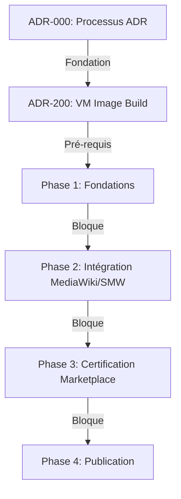

---
# 🤖 Machine-Readable Metadata (Frontmatter YAML)
# Permet parsing automatique par agents IA et recherche/filtrage avancé

# ⚠️ AVANT DE COMMENCER:
# 1. Lire ADR-000 (Processus) : ./000-META-processus-creation-adr.md
# 2. Consulter TAXONOMY.md pour classification complète
# 3. Vérifier README.md pour numérotation disponible dans votre plage
# 4. Ces 4 documents DOIVENT être cohérents - les consulter ensemble

adr: XXX  # Remplacer par numéro dans plage catégorie (voir 000-META)
title: "[Titre Descriptif de la Décision]"
status: "proposed"  # proposed|accepted|rejected|deprecated|superseded
date: YYYY-MM-DD
superseded_by: null
replaces: null
related_adrs: []  # Numéros ADRs liés
related_issues: []  # Issues GitHub liées

# 🗂️ Taxonomie ADR (Voir TAXONOMY.md pour détails complets)
classification:
  # Lifecycle: État dans le cycle de vie
  lifecycle: "proposed"  # proposed|accepted|rejected|deprecated|superseded
  
  # Domain: Domaine architectural principal (voir plages 000-META)
  # architecture|infrastructure|security|data|api|devops|test|business
  domain: "infrastructure"
  
  # Impact: Niveau d'impact sur le système
  impact: "medium"  # low|medium|high|critical
  
  # Quality Attributes (ASR): Qualités système affectées (ISO 25010)
  quality:
    - "reliability"       # availability, fault tolerance, recoverability
    - "security"          # TLS, authentication, authorization
    - "compliance"        # Azure Marketplace requirements, open source licenses
    # Autres: performance, maintainability, cost, usability, portability
  
  # Reversibility: Facilité de changement
  reversibility: "moderate"  # easy|moderate|hard|irreversible
  
  # Scope: Portée de la décision
  scope: "tactical"  # strategic|tactical|operational
  
  # Technology Area: Domaines technologiques concernés
  tech_areas:
    - "azure"
    - "vm"
    # Autres: mediawiki, semantic-mediawiki, php, mysql, apache, php-fpm, composer,
    #         packer, bicep, tls, nsg, bash

# Tags libres pour recherche flexible
tags: ["azure-marketplace", "vm", "mediawiki"]

# Stakeholders impliqués
stakeholders: ["@architecture-team", "@dev-team"]

# Effort estimé d'implémentation
effort: "medium"  # low|medium|high
---

# ADR XXX: [Titre Descriptif de la Décision]

<!-- PLACEHOLDER: Remplacer XXX par le prochain numéro séquentiel dans la plage de catégorie -->
<!-- PLACEHOLDER: Remplacer [Titre Descriptif] par un titre concis et actionable -->

## 📊 Vue d'Ensemble

| Attribut | Valeur |
|----------|--------|
| **Statut** | 🔄 Proposé |
| **Date Décision** | YYYY-MM-DD |
| **Stakeholders** | @architecture-team, @dev-team |
| **Impact** | 🔴 Élevé / 🟡 Moyen / 🟢 Faible |
| **Effort Implémentation** | 🔴 Élevé / 🟡 Moyen / 🟢 Faible |
| **Risque Technique** | 🔴 Élevé / 🟡 Moyen / 🟢 Faible |

<!-- PLACEHOLDER: Remplir le tableau ci-dessus avec les valeurs réelles -->

---

## 🎯 Contexte & Problème

<!-- PLACEHOLDER: Décrire le contexte et le problème ci-dessous -->
<!-- FORMAT: Paragraphes explicatifs + réponses aux questions guidées -->

### Questions Guidées

**1. Quel problème essayons-nous de résoudre?**
- [Décrire le problème principal dans le contexte smw-marketplace]
- [Impact actuel du problème sur le déploiement MediaWiki/SMW ou la certification Marketplace]

**2. Quelles sont les contraintes et exigences?**
- **Techniques**: [Ex: Compatibilité SMW, version PHP, MySQL, TLS]
- **Azure Marketplace**: [Ex: Exigences Microsoft certification VM, sécurité]
- **Client final**: [Ex: Organisations gérant une base de connaissances sémantique]
- **Open Source**: [Ex: Compatibilité licence GPL-2.0, dépendances]

**3. Quel est l'impact si nous ne prenons pas de décision?**
- **Court terme (0-3 mois)**: [Impact sur le développement / certification]
- **Moyen terme (3-12 mois)**: [Risque pour la publication Marketplace]
- **Long terme (12+ mois)**: [Impact sur l'adoption par les universités]

**4. Quels facteurs influencent cette décision?**
- **Exigences Microsoft Marketplace**: [Politiques de certification VM]
- **Stack SMW**: [Contraintes MediaWiki, SMW, PHP, MySQL, Apache]
- **Sécurité**: [TLS, NSG, hardening VM]
- **Reproductibilité**: [Automatisation provisioning, Packer, scripts]

---

## ✅ Décision

<!-- PLACEHOLDER: Décrire la décision prise ci-dessous -->
<!-- FORMAT: Approche + Justification + Principes appliqués -->

### Approche Choisie

[Décrire en détail la solution retenue]

**Exemple**:
> Nous adoptons **[solution choisie]** pour [objectif] afin de [bénéfice principal].
> Cette approche garantit [propriété clé] tout en respectant les exigences Azure Marketplace.

### Comment Cette Solution Résout le Problème

[Expliquer point par point comment la décision répond au problème]

1. **Problème X** → Résolu par [mécanisme Y]
2. **Exigence Marketplace Z** → Satisfaite via [approche W]
3. **Contrainte sécurité** → Adressée par [solution TLS/NSG]

### Principes Architecturaux Appliqués

- ✅ **Reproductibilité**: [Image VM construite de façon automatisée et idempotente]
- ✅ **Sécurité by design**: [TLS, hardening, principe moindre privilège]
- ✅ **Azure Well-Architected Framework**: [Piliers respectés: reliability, security]
- ✅ **Open Source Compliance**: [Compatibilité licence GPL-2.0 MediaWiki/SMW]
- ✅ **[Autre principe]**: [Description]

### Technologies/Outils Utilisées

| Technologie | Version | Rôle | Justification |
|-------------|---------|------|---------------|
| Azure Marketplace | - | Plateforme distribution | Standard Microsoft |
| Packer | ≥ 1.10 | Construction image VM | Automatisation IaC |
| Apache + PHP-FPM | Latest stable | Serveur web MediaWiki | Requis par MediaWiki |
| MySQL | 5.7+ / 8.x | Base de données SMW | Composant SMW SQLStore |
| [Autre] | [Version] | [Rôle] | [Justification] |

---

## 📊 Matrice de Décision Quantifiée

<!-- PLACEHOLDER: Remplir le tableau ci-dessous avec les scores réels -->
<!-- FORMAT: Évaluation objective sur 10 pour chaque critère -->

| Critère | Poids | Alternative 1 | Alternative 2 | Décision Choisie | Notes |
|---------|-------|---------------|---------------|------------------|-------|
| **Conformité Marketplace** | 30% | 🟡 Moyen (5/10) | 🟢 Élevé (9/10) | 🟢 Élevé (10/10) | Exigences Microsoft |
| **Sécurité** | 25% | 🟡 Moyen (6/10) | 🟢 Élevé (8/10) | 🟢 Élevé (9/10) | TLS, hardening |
| **Facilité déploiement client** | 20% | 🟢 Simple (8/10) | 🟡 Moyen (5/10) | 🟢 Simple (8/10) | Universités ciblees |
| **Maintenabilité** | 15% | 🟡 Moyen (6/10) | 🟢 Élevé (8/10) | 🟢 Élevé (9/10) | Scripts reproductibles |
| **Coût infrastructure** | 10% | 🟢 Faible (8/10) | 🔴 Élevé (4/10) | 🟡 Moyen (7/10) | VM sizing |
| **Score Total Pondéré** | 100% | **6.30** | **7.45** | **9.05** ⭐ | Winner |

### Calcul Détaillé (Pour Validation IA)

```
Alternative 1: (5*0.30) + (6*0.25) + (8*0.20) + (6*0.15) + (8*0.10) = 6.30
Alternative 2: (9*0.30) + (8*0.25) + (5*0.20) + (8*0.15) + (4*0.10) = 7.45
Décision:      (10*0.30) + (9*0.25) + (8*0.20) + (9*0.15) + (7*0.10) = 9.05 ✅
```

---

## ⚖️ Conséquences

### ✅ Positives (Bénéfices)

| Bénéfice | Métrique Cible | Valeur Attendue | Mesure |
|----------|----------------|-----------------|--------|
| Conformité Marketplace | Certification Microsoft | ✅ Certifié | Processus certification |
| Sécurité VM | TLS grade | A+ (ssllabs.com) | Test SSL Labs |
| Reproductibilité | Déploiement automatisé | 100% idempotent | Tests CI/CD |
| Facilité client | Temps déploiement | < 30 minutes | Test utilisateur |

### ⚠️ Négatives (Risques & Limitations)

| Risque | Impact | Probabilité | Mitigation | Responsable | Deadline |
|--------|--------|-------------|------------|-------------|----------|
| Changements exigences Marketplace | 🟡 Moyen | 🟡 Moyen | Veille Microsoft Marketplace | @devops-team | Trim. |
| Complexité provisioning | 🟡 Moyen | 🟢 Faible | Scripts bien documentés | @dev-team | Phase 1 |
| **Dépendances SMW upstream** | 🟡 Moyen | 🟡 Moyen | Version pinning, tests régression | @dev-team | Continu |

---

## 🔄 Alternatives Considérées

### Alternative 1: [Nom Descriptif]

**Description**:
[Brève description de l'alternative avec détails techniques]

**Avantages**:
- ✅ [Avantage 1]
- ✅ [Avantage 2]

**Inconvénients**:
- ❌ [Inconvénient 1]
- ❌ [Inconvénient 2]

**Rejetée parce que**:
[Raisons principales du rejet, référence à la matrice de décision]

**Score Matrice**: 6.30/10

---

### Alternative 2: [Nom Descriptif]

**Description**:
[Brève description]

**Avantages**:
- ✅ [Avantage 1]

**Inconvénients**:
- ❌ [Inconvénient 1]

**Rejetée parce que**:
[Raisons]

**Score Matrice**: 7.45/10

---

## 🚀 Plan d'Implémentation

### Phases & Deliverables

| Phase | Durée Estimée | Deliverables | Blockers Potentiels | Critères de Validation | Responsable |
|-------|---------------|--------------|---------------------|------------------------|-------------|
| **Phase 1: Fondations** | 2 semaines | - Configuration initiale<br>- Scripts de base<br>- Tests unitaires | - Accès Azure<br>- Approbation architecture | - CI vert<br>- Code review approuvé | @dev-team |
| **Phase 2: Intégration MediaWiki** | 2 semaines | - Installation MediaWiki + SMW complète<br>- Configuration MySQL<br>- TLS actif | - Image OS de base validée | - MediaWiki accessible<br>- SMW activé OK | @dev-team |
| **Phase 3: Certification** | 1 semaine | - Image VM finalisée<br>- Tests Marketplace<br>- Documentation | - Toutes phases précédentes OK | - Validation Microsoft<br>- Smoke tests | @devops-team |
| **Phase 4: Publication** | 3 jours | - Publication Marketplace<br>- Docs client finales | - Certification approuvée | - Offre visible Marketplace | @architecture-team |

### Dépendances & Ordre d'Exécution



---

## 🎯 Critères de Succès & Validation

### Métriques de Succès (Post-Implémentation)

| Métrique | Valeur Cible | Valeur Baseline | Statut Actuel | Date Mesure |
|----------|--------------|-----------------|---------------|-------------|
| **Certification Microsoft Marketplace** | ✅ Certifiée | Non certifiée | ⏳ En cours | - |
| **Déploiement VM < 30 min** | < 30 minutes | N/A | ⏳ À mesurer | - |
| **TLS Grade** | A+ | N/A | ⏳ À mesurer | - |
| **Temps provisioning automatisé** | < 45 min | N/A | ⏳ À mesurer | - |

### Critères de Re-évaluation

**Déclencher une review complète si**:
- ⚠️ Changement majeur exigences Microsoft Marketplace
- ⚠️ Nouvelle version majeure MediaWiki / SMW disponible
- ⚠️ Faille de sécurité critique dans un composant
- ⚠️ Migration OS base (Ubuntu LTS, RHEL)

**Responsable Review**: @architecture-team  
**Fréquence Review Planifiée**: Tous les 6 mois

---

## 🔗 Traçabilité & Liens

### Issues GitHub Liées

| Issue | Type | Relation | Description |
|-------|------|----------|-------------|
| [#XX](link) | Feature | **Origine** | [Description de l'issue qui a motivé cet ADR] |

### ADRs Connexes

| ADR | Titre | Relation | Impact |
|-----|-------|----------|--------|
| [ADR-000](000-META-processus-creation-adr.md) | Processus ADR | **Processus** | Gouvernance ADR |

### Documentation Externe

- [Azure Marketplace VM Offer](https://learn.microsoft.com/en-us/azure/marketplace/azure-vm-offer-setup)
- [Semantic MediaWiki](https://www.semantic-mediawiki.org/)
- [MediaWiki Documentation](https://www.mediawiki.org/wiki/MediaWiki)
- [Azure Well-Architected Framework](https://learn.microsoft.com/en-us/azure/well-architected/)

---

## 📝 Notes & Historique

### Changelog

| Date | Auteur | Changement | Raison |
|------|--------|------------|--------|
| YYYY-MM-DD | @architect | Création initiale | Issue #XX |

---

## 🤖 Métadonnées IA (Machine-Only)

```json
{
  "adr_id": "XXX",
  "project": "smw-marketplace",
  "parsing_version": "2.0",
  "generated_at": "YYYY-MM-DDTHH:mm:ssZ",
  "validation_status": "valid",
  "dependency_graph": {
    "depends_on": [],
    "blocks": [],
    "related": []
  }
}
```

---

## 📋 Instructions d'Utilisation

### Pour Humains

1. **Copier ce template**: `cp adr-template-ai-optimized.md XXX-CATÉGORIE-titre-decision.md`
2. **Choisir la catégorie** et **numéro dans la plage** :
   - META (000-099), ARCH (100-199), INFRA (200-299), SEC (300-399)
   - DATA (400-499), API (500-599), DEVOPS (600-699), TEST (700-799), BIZ (800-899)
3. **Remplacer XXX** : Par le prochain numéro disponible dans la plage de votre catégorie
4. **Remplir frontmatter YAML** : Métadonnées + classification 7 dimensions
5. **Compléter placeholders** : Chercher `<!-- PLACEHOLDER:` et remplacer
6. **Remplir matrice décision** : Évaluer objectivement chaque critère sur 10
7. **Valider avec équipe** : Review par stakeholders listés
8. **Committer** : `git commit -m "docs(adr): ADR-XXX [CATÉGORIE] Titre"`
9. **Ajouter à l'index** : Mettre à jour `docs/adr/README.md`

**Exemples noms fichiers (contexte smw-marketplace)** :
```bash
000-META-processus-creation-adr.md              # Méta (000-099)
100-ARCH-architecture-smw-vm-offer.md           # Architecture (100-199)
200-INFRA-azure-vm-image-packer.md              # Infrastructure (200-299)
300-SEC-tls-network-security-groups.md          # Sécurité (300-399)
400-DATA-mysql-semantic-schema.md               # Données (400-499)
500-API-mediawiki-api-integration.md            # API (500-599)
600-DEVOPS-packer-ci-pipeline.md                # DevOps (600-699)
700-TEST-marketplace-certification.md           # Tests (700-799)
800-BIZ-azure-marketplace-offer-model.md        # Business (800-899)
```

---

## ✅ Checklist Complétude

### Minimum Requis (Obligatoire)
- [ ] Frontmatter YAML rempli (adr, title, status, date, classification)
- [ ] Section Contexte complète (≥ 200 mots)
- [ ] Section Décision complète (≥ 150 mots)
- [ ] Matrice décision avec ≥ 3 critères
- [ ] Conséquences positives ET négatives listées
- [ ] ≥ 2 alternatives considérées
- [ ] Plan implémentation avec phases
- [ ] Critères de succès définis

### Recommandé (Haute Valeur)
- [ ] Métriques quantifiées dans conséquences
- [ ] Stratégies mitigation pour risques élevés
- [ ] Dépendances ADRs/Issues explicites
- [ ] Références documentation Azure Marketplace
- [ ] Conformité open source (GPL-2.0 MediaWiki/SMW) vérifiée

---

**Version Template**: 2.0 (AI-Optimized)  
**Dernière Mise à Jour**: 2026-02-21  
**Projet**: smw-marketplace  
**Compatibilité**: Agents IA (ChatGPT, Claude, Copilot) + Humains
